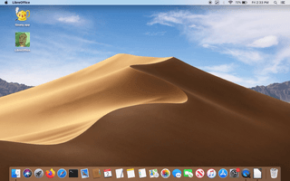

# createReport
Bash script to create a "Weekly Report" ODT document with current date and page numbers, saves with current date filename, and then opens the saved document with LibreOffice Writer.

Written for OSX/Linux.

## :memo: Usage

Open the "createReport" folder and double-click on the file named "reportSetup". This will move the hidden folder ".MyScripts" to the user's home/root folder.

Open crontab and copy and paste (or retype) the line from the file named "cron job with perl command".

This crontab line's default is for the report to be created every Monday at 7:00am, while the perl command implements a random sleep within a 30 minute period (1800 seconds). 
Therefore the cron job will run every Monday at 7:00am which will cause the Weekly Report to be created at a random time between 7:00am and 7:30am.

You can change the time, day, etc. in the crontab expression, and/or remove the perl command if you don't need the creation of the report to be randomized.

## :apple::penguin: Dependencies

Written in bash for OSX/Linux. Requires LibreOffice Writer, as the script creates an ODT file. Microsoft Word and/or OpenOffice should work too.

The line in the file named "cron job with perl command" is to be copied and pasted into crontab, but you can use launchd or automator if you want.